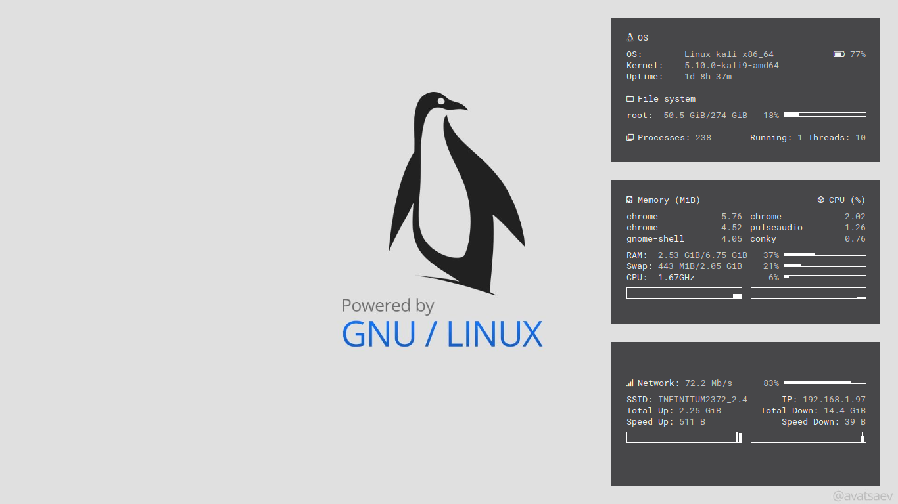
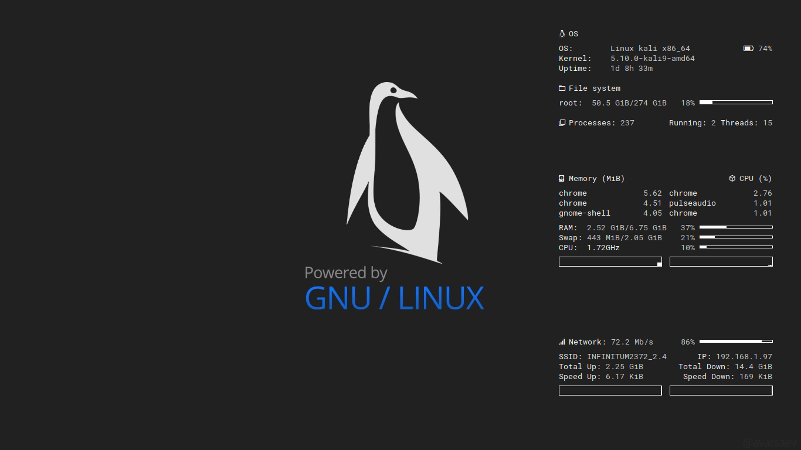
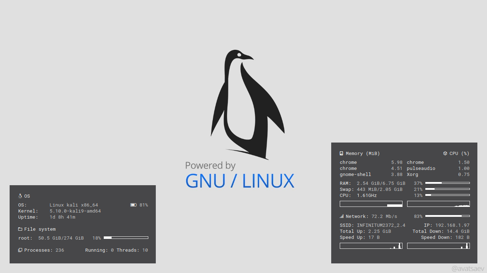
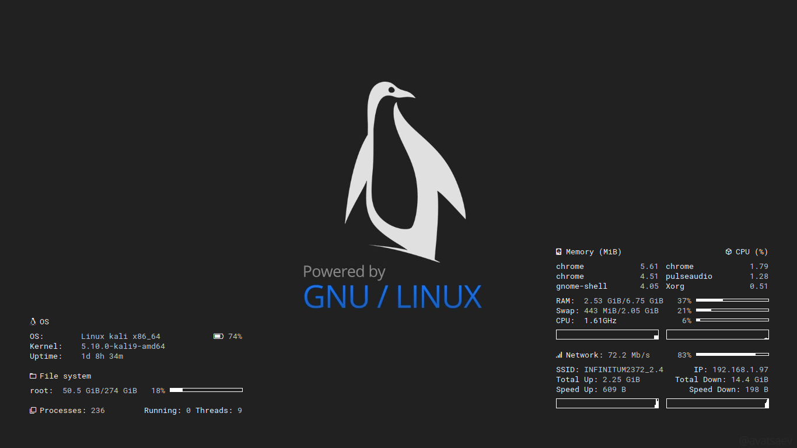
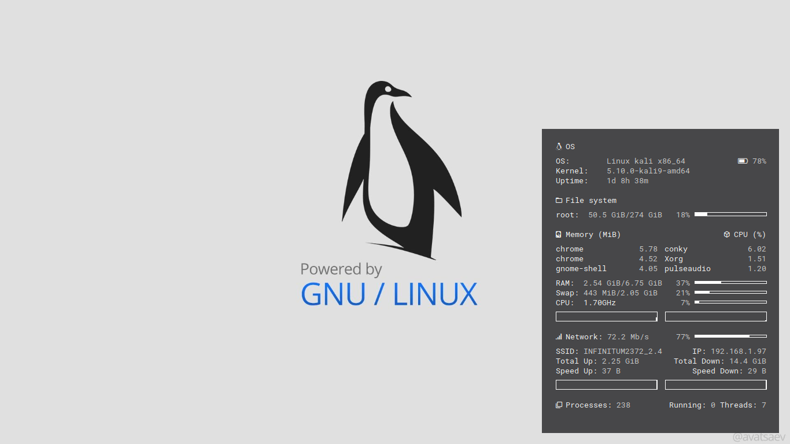
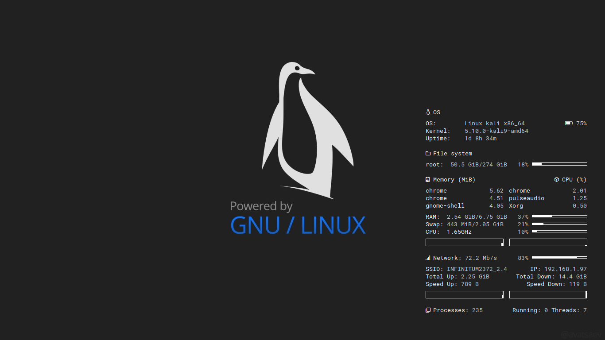
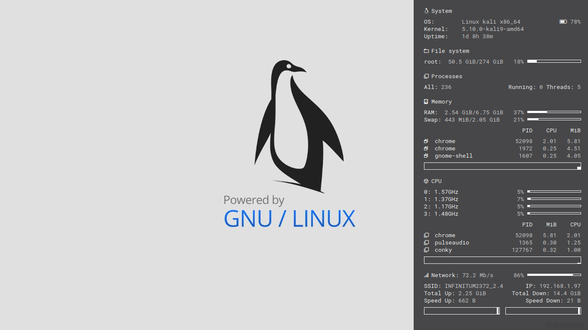
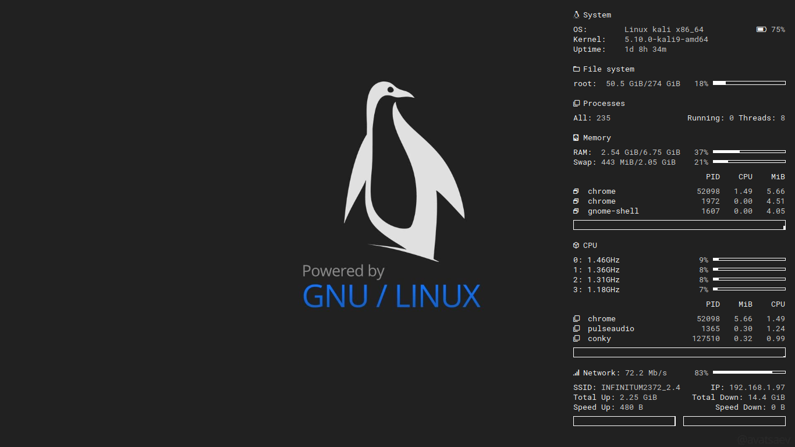

# Conky themes (tested with *conky 1.11.6*)
A collection of *[conky](https://github.com/brndnmtthws/conky)* themes.
## Usage
1. Install *[Roboto Nerd Font](fonts)*.
2. Install *[conky](https://github.com/brndnmtthws/conky)*.
3. Create *$HOME/.config/conky* directory if not exists.
4. Clone this repository.
5. Move the folder *themes* into your *$HOME/.config/conky* directory.
6. Run *[launch.sh](launch.sh)* script.
### Example *(debian based distros)*
```bash
sudo apt install conky
mkdir $HOME/.config/conky
git clone https://github.com/AguilarLagunasArturo/conky-themes.git
cd conky-themes
mv themes $HOME/.config/conky
./launch.sh
```
You can edit *[launch.sh](launch.sh)* to launch one of the following themes or just launch it manually `conky -c <path-to-theme>`.

## Notes & Tips
1. Fonts: Ensure Roboto Mono Nerd Font is installed, otherwise icons may not render.
2. Icons: Some icons may be missing due to outdated or removed glyphs; update the font if needed.
3. Positioning: Adjust gap_x and gap_y in the theme config to move the board on your screen.
///
4. Network Interface: Replace interface names (wl0, wlp46s0, etc.) in the configuration to match your system:
## Check network configure
```bash
ls a
```


## Preview
### Splitted

### Splitted (clear)

### Dual

### Dual (clear)

### Minimal

### Minimal (clear)

### Strip

- Secreen resolution:
    - 1920x1080
    - 1366x768
### Strip (clear)

- Secreen resolution:
    - 1920x1080
    - 1366x768
